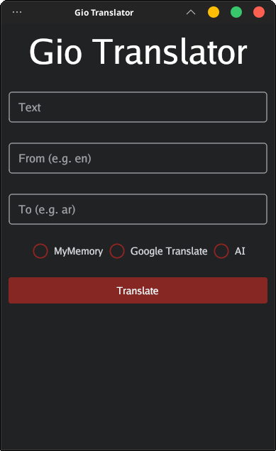
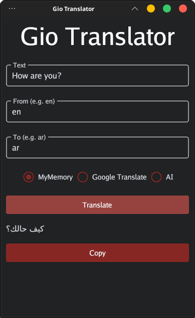

# Gio Translator

Gio Translator is a cross-platform application built using Golang and the Gio UI library. This application aims to provide a simple and efficient tool for translating text across different languages in a user-friendly interface.

## Features

- Cross-platform compatibility
- User-friendly interface
- Text translation between various languages
- Translation services powered by MyMemory, Unofficial Google Translate, and Unofficial DuckDuckGo Ai
- Built with Golang and the Gio UI library

## Screenshots





## Getting Started

### Download

You can download the latest release of Gio Translator from the [Releases](https://github.com/ysdragon/Gio-Translator/releases) page. Choose the appropriate version for your operating system.

### Building from Source

To build Gio Translator from source, follow these steps:

1. Clone this repository to your local machine
```bash
git clone https://github.com/ysdragon/Gio-Translator.git
```
2. Install the necessary dependencies
```bash
go mod download
```
3. Build the application
```bash
go build -o gio-translator
```
4. Run the compiled binary
```bash
./gio-translator
```

## Usage

- Input the text you want to translate.
- Enter the source language and the target language.
- Select between MyMemory, Google Translate, AI.
- Click the translate button to see the translation.

## TODO

* [x]  Dark theme.
* [x]  AI as a translation source.
* [ ]  Light/Dark theme switcher.

## Technologies Used

- [Golang](https://go.dev/)
- [Gio UI](https://gioui.org/)

## Contributing

If you'd like to contribute to Gio Translator, feel free to submit a pull request. Contributions are welcomed!

## License

This project is licensed under the [MIT License](LICENSE).
